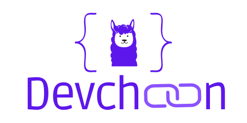

DevChain-Studio : DevChain Vscode extension
==============================

🚀 Use LLM to prototype, build and understand the creation of your applications 🚀

## 🔥 What ? 

**DevChain** is an AI powered application that helps you build software by providing code. It relies on a multi-agent system to simulate the developpment life cycle, following more or less the Scrumban methodology. It is built on top of the [Langchain](https://www.langchain.com/) framework. Each agent of the system will be powered and simulated by a Large Language Model (LLM).

### Important

**Devchain** was thought to be a **Supercharged** coding assistant, not exactly a "Software engineer". It is meant to help developers accelerate their own workflows, by providing a load of comprehensive and adaptated document to better understand the initial idea. It is supposed to help developers to prototype and develop faster by providing reasoned code.

